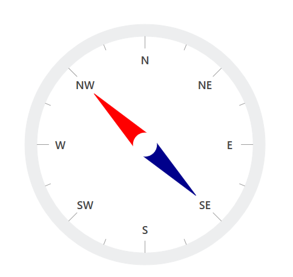

# How-to-create-the-directional-compass-with-the-WPF-circular-gauge-SfCircularGauge-
This demo explains How to create the directional compass with the WPF circular gauge (SfCircularGauge)


 
## Creating the above UI

Above use case has been achieved by using the below code snippet

[XAML]

```
     <gauge:SfCircularGauge SpacingMargin="0.7">
        <gauge:SfCircularGauge.Scales>
            <gauge:CircularScale StartAngle="270" SweepAngle="360" ShowLastLabel="False" TickPosition="Custom"
                                     LabelOffset="0.75" RimStroke="#EDEEEF" Interval="1" RimStrokeThickness="0"
                                     StartValue="0" EndValue="8" TickStrokeThickness="2" RimStartOffset="1" RimEndOffset="0.9"
                                     FontSize="18" FontWeight="SemiBold" LabelPosition="Custom" RangePosition="Custom"
                                     MinorTicksPerInterval="1" LabelCreated="CircularScale_LabelCreated">
                <gauge:CircularScale.MinorTickSettings>
                    <gauge:MinorTickSetting  StrokeThickness="1" Offset="0.9" ></gauge:MinorTickSetting>
                </gauge:CircularScale.MinorTickSettings>
                <gauge:CircularScale.MajorTickSettings>
                    <gauge:MajorTickSetting  StrokeThickness="1" Offset="0.9" ></gauge:MajorTickSetting>
                </gauge:CircularScale.MajorTickSettings>
                <gauge:CircularScale.Pointers>
                    <gauge:CircularPointerCollection>
                        <gauge:CircularPointer PointerType="NeedlePointer" KnobFill="White" Value="7"
                                                   NeedlePointerStroke="Red" NeedlePointerStrokeThickness="35" EnableAnimation="False"
                                                   NeedlePointerType="Triangle"  NeedleLengthFactor="0.6"
                                                   ></gauge:CircularPointer>
                        <gauge:CircularPointer PointerType="NeedlePointer" KnobFill="White" 
                                                   NeedlePointerType="Triangle" KnobRadiusFactor="0.1"
                                                    NeedlePointerStroke="DarkBlue"  NeedleLengthFactor="0.6" EnableAnimation="False"
                                                   NeedlePointerStrokeThickness="35" Value="3">
                        </gauge:CircularPointer>
                    </gauge:CircularPointerCollection>
                </gauge:CircularScale.Pointers>
            </gauge:CircularScale>
        </gauge:SfCircularGauge.Scales>
    </gauge:SfCircularGauge>

```

[C#]

```
        private void CircularScale_LabelCreated(object sender, LabelCreatedEventArgs args)
        {
            switch ((string)args.LabelText)
            {
                case "0":
                    args.LabelText = "N";
                    break;
                case "1":
                    args.LabelText = "NE";
                    break;
                case "2":
                    args.LabelText = "E";
                    break;
                case "3":
                    args.LabelText = "SE";
                    break;
                case "4":
                    args.LabelText = "S";
                    break;
                case "5":
                    args.LabelText = "SW";
                    break;
                case "6":
                    args.LabelText = "W";
                    break;
                case "7":
                    args.LabelText = "NW";
                    break;
            }
        }

```

## See also

[How to add different types of needle pointer in WPF circular Gauge](https://help.syncfusion.com/wpf/radial-gauge/pointers#different-types-of-needle-pointer)

[How to customize the needle pointer in WPF circular Gauge](https://help.syncfusion.com/wpf/radial-gauge/pointers#needle-pointer-customization)

[How to customize the needle pointer knob in WPF circular Gauge](https://help.syncfusion.com/wpf/radial-gauge/pointers#needle-pointer-knob-customization)

[How to set visibility for needle pointer in WPF circular Gauge](https://help.syncfusion.com/wpf/radial-gauge/pointers#setting-visibility-of-needle-pointer)

[How to set tail for needle pointer in WPF circular Gauge](https://help.syncfusion.com/wpf/radial-gauge/pointers#setting-tail-for-needle-pointer)
